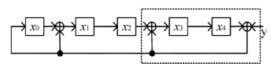
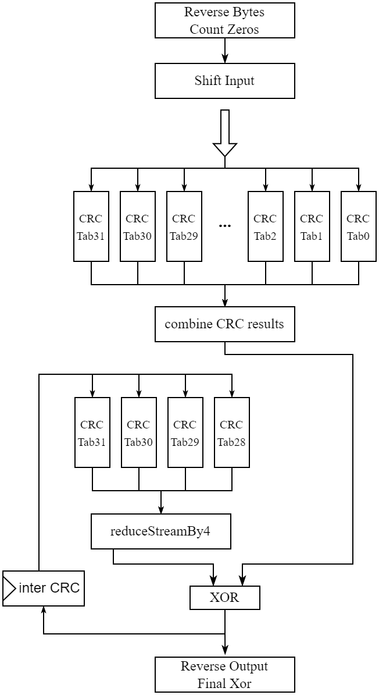
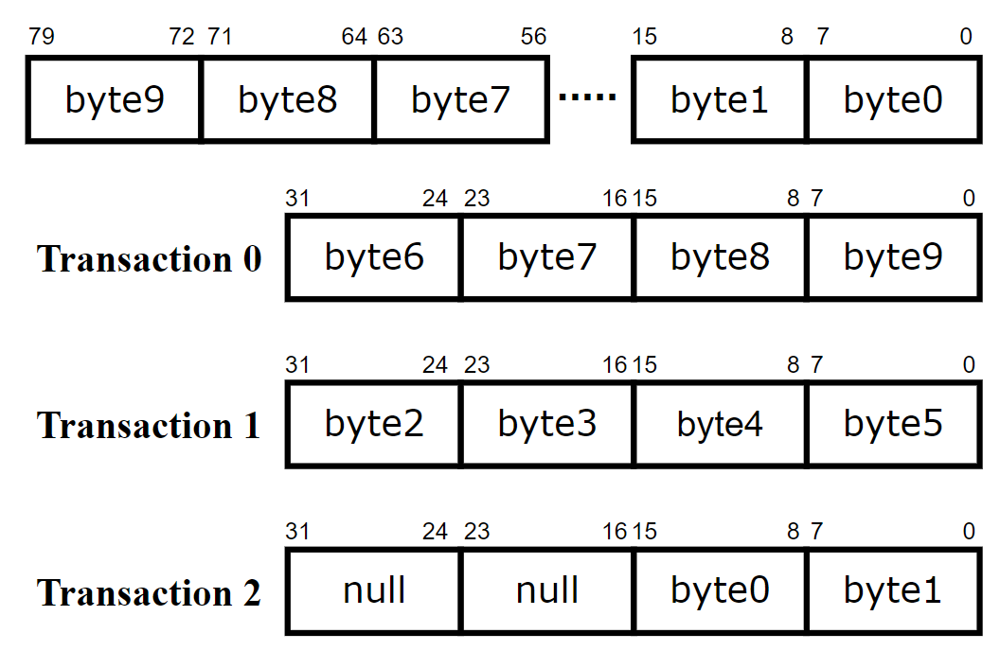

# Blue-CRC

## Overview

The [Cyclic Redundancy Code(CRC)](https://en.wikipedia.org/wiki/Cyclic_redundancy_check) is an error-detecting algorithm commonly used in digital communication systems. It works by appending a checksum to the original data being transmitted, which allows the receiver to verify if the data has been corrupted during transmission. The CRC calculation is widely used in many fields especially the network transmission, many standard protocols likes Ethernet all require CRC calculations. With the development of communication technology, the speed of network transmission improves greatly which also poses challenges for implementing CRC with high performance. This repo provides a highly parameterized, parallel, pipelined and high-throughput hardware implementation of CRC algorithm using [Bluespec System Verilog](https://github.com/B-Lang-org/bsc).

### Main Features

The main features of the implemented CRC IP are listed as follows:

- Complete CRC Configuration: The IP supports complete CRC configuration parameters including polynomial, initVal(the initial CRC value), finalXor(the result is xor’d with this value if desired), reverseOutput(if True, reverse the input bit order), reverseInput(if True, reverse the result bit order).
- Standard I/O Interface: The input interface supports AXI-Stream protocol whose data width is parameterized. And the output CRC checksum is transmitted following the basic valid-ready handshake protocol.
- Parallel and Pipelined: The IP is designed to process multiple bytes per cycle, and can reach the working frequency of 500MHz on Xilinx xcvu9p FPGA.
- High Throughput: The IP configured with 256-bit input and 32-bit CRC output reaches at most throughput of 128Gb/s.
- Two computing modes: The IP supports both CRC generation mode used in the sender and CRC verification mode used in the receiver.


## Algorithm Theory

The idea of our parallel and high-performance CRC implementation comes from the [paper](https://ieeexplore.ieee.org/abstract/document/5501903) and its corresponding [open-source implementation](https://bitbucket.org/spandeygit/crc32_verilog). And main contributions of this repo compared to the existing work include:

- Parameterize the original design and provide a standard interface;
- Refine the logic implementation to improve the timing issue;

The calculation of CRC of original data is basically a division operation on two polynomials based on modulo-2 arithmetic and the remainder of this division is just the checksum we wanted. Consider a m-bit original data $b_{m-1}b_{m-2}b_{m-3}...b_{1}b_{0}$ can be represented as the polynomial M(x):

$$
M(x)=b_{m-1}x^{m-1}+b_{m-2}x^{m-2}+...+b_{1}x+b_{0}
$$

And a predetermined (n+1)-bit generator polynomial can be represented as G(x):

$$
G(x)=b_{n}x^{n}+b_{n-1}x^{n-1}+...+b_{1}x^{1}+b_{0}
$$

And the CRC is derived following the equation below:

$$
CRC=remainder(\frac{M(x)x^{n}}{G(x)})
$$

And more detailed introduction of CRC can be accessed through this [link](https://en.wikipedia.org/wiki/Cyclic_redundancy_check). Based on the characteristics of modulo-2 arithmetic, CRC calculation can be easily implemented using a LFSR register as the figure shown below:


<div align=center></div>
However, the LFSR implementation takes only one-bit per cycle, which only provides a poor throughput. In order to get a parallel and high-performance CRC design, the serial implementation demonstrated above should be rearranged into a parallel configuration. And the following two theorems is used to achieve parallelism in CRC computation.

- Theorem 1:

$$
CRC[A(x)]=CRC(\sum_{i=1}^{n}A_{i})=\sum_{i=1}^{n}CRC(A_{i})
$$

- Theorem 2:

$$
CRC[x^kA(x)] = CRC[x^kCRC[A(x)]]
$$

Theorem 1 indicates that original data of any length can be split into multiple pieces and CRC calculation of each piece can be performed parallel and then combined to get complete CRC result of original data. In our designed, the length of one piece is 8-bit and it’s assumed that the length of original data is multiples of bytes. For example, a N-bit original data, represented as polynomial $A(x)$, can be divided into n bytes, i.e. $N=8\times n$, each byte of original data is represented as the polynomial $A_{i}(x)$, and $A(x)$ can be expressed as:

$$
A(x)=\sum_{i=0}^{n}A_i(x)\ x^{8i}
$$

And the CRC of A(x) is derived as below:

 

$$
CRC(A(x))=CRC(A_{n-1}(x)x^{8(n-1)}+CRC(A_{n-2}x^{8(n-2)}))+... +CRC(A_{1}(x)x^8)+ CRC(A_{0}(x))
$$

To calculate the CRC of each 8-bit piece, we don't have to implement real circuit instead it' more efficient to precompute the CRC results of all possible values of 8-bit data and store them in hardware lookup table. When we need to compute CRC, we can just search the precomputed table using the input data as index.

However, the parallel scheme proposed above is still impractical for hardware implementation. In most cases, the length of original data to be computed is random and the hardware only supports fixed data width. What’s more, the length of original data is usually huge, especially for network application, and the amount of memory resources used to implement lookup tables grows with data length linearly. So for real hardware implementation, the width of input data bus of CRC component is usually fixed and original data is split into multiple pieces of input bus width and sent into the component serially. And the hardware needs to compute the CRC result in an accumulative manner. In each cycle, the circuit calculates CRC checksum of input frame based on Theorem 1, and then combines it with the CRC result of former frame. 

The combination of CRC of current input frame with that of former frames is based on Theorem 2. Assume that raw data is transmitted in big-endian byte order, the width of the input data bus is 256 bits, the data of the current frame is $A(x)$ and the data of former frames is $A'(x)$. We need to combine $CRC[A(x)]$ with already calculated $CRC[A'(x)]$ to get $ CRC[A'(x)x^{256} + A(x)]$. Based on Theorem 2, we can derive the equation below:
$$
CRC[A'(x)x^{256}+A(x)]=CRC[A'(x)x^{256}]+CRC[A(x)]=CRC[CRC[A'(x)]\times x^{256}]+CRC[A(x)]
$$
The equation shows that the circuit needs to shift CRC result of former frames first and then perform CRC calculation on it again before the accumulation. And the CRC calculation here can also be implemented using lookup tables.
There's one more case to consider, that is, the length of raw data may not just be multiples of 256-bit, so you cannot directly use the above formula for accumulation when processing the last input frame. We need to dynamically calculate the actual width of the last frame of each packet. If the width is m, the following formula is used for accumulation:
$$
CRC[A'(x)x^m+A(x)]=CRC[CRC[A'(x)]\times x^m]+CRC[A(x)]
$$


## Hardware Architecture

Based on the parallel scheme proposed above, a simplified pipelined hardware architecture used in our design is shown in the figure below. To improve the throughput, the design of CRC circuit adopts an eight-stage pipeline architecture, in which the first five stages calculate the checksum of the input data fragment and accumulate it to the intermediate CRC value. The last three stages is used to handle CRC accumulation when the last frame of data is not aligned (the width of raw data is not multiples of the width of input bus).
<div align=center></div>

## Area Usage and Frequency
The actual performance and hardware resources utilization of CRC circuits depend on specific configuration parameters. In most cases, the throughput of the hardware circuit increases with the width of input data bus, and the hardware resources utilization is related to both data bus width and checksum width. Taking the 32-bit CRC checksum specified by the IEEE 802-3 protocol as an example, CRC circuit with input bus configured at 256-bit can reach the operating frequency of 500MHz on Xilinx xcvu9p FPGA device, and the total throughput rate can reach 128Gb/s. The actual utilization of hardware resource is as follows:

```verilog
CLB Logic:
+----------------------------+-------+-------+------------+-----------+-------+
|          Site Type         |  Used | Fixed | Prohibited | Available | Util% |
+----------------------------+-------+-------+------------+-----------+-------+
| CLB LUTs                   | 21584 |     0 |          0 |   1182240 |  1.83 |
|   LUT as Logic             | 10636 |     0 |          0 |   1182240 |  0.90 |
|   LUT as Memory            | 10948 |     0 |          0 |    591840 |  1.85 |
|     LUT as Distributed RAM | 10948 |     0 |            |           |       |
|     LUT as Shift Register  |     0 |     0 |            |           |       |
| CLB Registers              |  9647 |     0 |          0 |   2364480 |  0.41 |
|   Register as Flip Flop    |  9647 |     0 |          0 |   2364480 |  0.41 |
|   Register as Latch        |     0 |     0 |          0 |   2364480 |  0.00 |
| CARRY8                     |     0 |     0 |          0 |    147780 |  0.00 |
| F7 Muxes                   |     0 |     0 |          0 |    591120 |  0.00 |
| F8 Muxes                   |     0 |     0 |          0 |    295560 |  0.00 |
| F9 Muxes                   |     0 |     0 |          0 |    147780 |  0.00 |
+----------------------------+-------+-------+------------+-----------+-------+

BLOCKRAM:
+----------------+------+-------+------------+-----------+-------+
|    Site Type   | Used | Fixed | Prohibited | Available | Util% |
+----------------+------+-------+------------+-----------+-------+
| Block RAM Tile |    0 |     0 |          0 |      2160 |  0.00 |
|   RAMB36/FIFO* |    0 |     0 |          0 |      2160 |  0.00 |
|   RAMB18       |    0 |     0 |          0 |      4320 |  0.00 |
| URAM           |    0 |     0 |          0 |       960 |  0.00 |
+----------------+------+-------+------------+-----------+-------+
```

## User Guide
### Configuration Parameters

The following table lists the configuration parameters of CRC

| Name | Description | Requirement |
| --- | --- | --- |
| crc_width      | The width of CRC checksum | The width needs to be a multiple of 8 |
| axi_keep_width | The width of tkeep field in AXI-Stream protocol | / |
| polynomial     | The value of generator polynomial | The value should be in the range restricted by crc_width |
| init_value     | The initial value for CRC calculation | The value should be in the range restricted by crc_width |
| final_xor      | The final result is xor’d with this value  | The value should be in the range restricted by crc_width |
| reverse_input  | if True, reverse the bit order of each byte of input data | Two available options: reverse or not_reverse |
| reverse_output | if True, reverse the bit order of whole final result | Two available options: reverse or not_reverse |
| mem_file_prefix| The name prefix of files containing lookup tables| /|
| crc_mode       | The computation mode of CRC circuit | Two available modes: (1) SEND: appends zero after raw data and is used for CRC generation in the sender; (2) RECV: calculates division of raw data by polynominal without appending zeros and is used for CRC verification in the receiver;|


### Input Format
CRC hardware receives the incoming data from the upstream module based on the AXI-Stream bus protocol, and the checksum output port uses the valid-ready handshake mechanism to interact with the downstream module. The Verilog ports generated by the top-level module of the circuit are as follows:
```verilog
module mkCrcRawAxiStreamCustom(
    input CLK,
    input RST_N,
    
    input s_axis_tvalid,
    input s_axis_tdata,
    input s_axis_tkeep,
    input s_axis_tlast,
    input s_axis_tuser,
    output s_axis_tready,
    
    output m_crc_stream_data,
    output m_crc_stream_valid,
    input  m_crc_stream_ready
);
```
When initiating CRC computation, the original data must be transmitted in big-endian byte order, that is, the high byte must be transmitted preferentially. Assuming that the width of the input AXI-Stream bus of CRC circuit is 32-bit(4-byte) and the with of raw data is 80-bit(10-byte), the transmission needs three cycles and the AXI-Stream frame for each cycle is shown below:
<div align=center></div>

### BSV Interface
The blue-crc is based on the Bluespec SystemVerilog hardware description language, so for designers using BSV, CRC modules can be used directly through instantiation. Detailed steps to use it are as follows:
1. Get source code: blue-crc uses the AXI-Stream interface provided by the blue-wrapper project, so you need to add the --recursive option to get this part of the code when cloning:
```shell
git clone --recursive https://github.com/datenlord/blue-crc.git
```
2. Import modules:
```Verilog
import CrcDefines :: *;
import CrcAxiStream :: *;
import AxiStreamTypes :: *;
```
3. Specify Configuration Parameters: The **CrcConfig** struct encapsulates the configuration parameters for CRC hardware circuits. The definition of **CrcConfig** struct is as follows:
```verilog
typedef struct {
    Bit#(crcWidth) polynominal;
    Bit#(crcWidth) initVal;
    Bit#(crcWidth) finalXor;
    IsReverseBitOrder revInput;
    IsReverseBitOrder revOutput;
    String memFilePrefix;
    CrcMode crcMode;
} CrcConfig#(numeric type crcWidth) deriving(Eq, FShow);

typedef enum {
    CRC_MODE_RECV,
    CRC_MODE_SEND
} CrcMode deriving(Eq, FShow);

typedef enum {
    BIT_ORDER_REVERSE,
    BIT_ORDER_NOT_REVERSE
} IsReverseBitOrder deriving(Eq, FShow);
```

4. Instantiate **CrcAxiStream**: The top-level interface **CrcAxiStream** is defined as follows:
```verilog
typedef Bit#(width) CrcResult#(numeric type width);
typedef Get#(CrcResult#(crcWidth)) CrcResultGet#(numeric type crcWidth);
typedef Put#(AxiStream#(keepWidth, AXIS_USER_WIDTH)) AxiStreamPut#(numeric type keepWidth);

interface CrcAxiStream#(numeric type crcWidth, numeric type axiKeepWidth);
    interface AxiStreamPut#(axiKeepWidth) crcReq;
    interface CrcResultGet#(crcWidth) crcResp;
endinterface
```

Take the 32-bit CRC specified in the IEEE 802-3 protocol as an example, if you want to get CRC circuit with 256-bit input data bus, the detailed instantiation code is as follows:
```verilog
CrcConfig#(32) conf = CrcConfig {
    polynominal: 32'h04C11DB7,
    initVal    : 32'hFFFFFFFF,
    finalXor   : 32'hFFFFFFFF,
    revInput   : BIT_ORDER_REVERSE,
    revOutput  : BIT_ORDER_REVERSE,
    memFilePrefix: "mem_tab",
    crcMode: CRC_MODE_SEND
};
CrcAxiStream#(32, 256) crc <- mkCrcAxiStream(conf);
```

5. Generate lookup table files: The script for generating lookup table files is **scripts/gen_crc_tab.py.**. Before using this script, you need to specify CRC configuration in .json format, whose content must be consistent with the configuration in BSV code:
```json
{
    "crc_width": 32,
    "axi_keep_width": 32,
    "polynomial": "0x04C11DB7",
    "init_value": "0xFFFFFFFF",
    "final_xor": "0xFFFFFFFF",
    "reverse_input": true,
    "reverse_output": true,
    "mem_file_prefix": "crc_tab",
    "crc_mode": "CRC_MODE_SEND"
}
```

6. Once .json file is configured, run the script using python (you need to pass in the JSON configuration file path and output file path):
```shell
python3 gen_crc_tab.py JSON文件路径 文件输出路径
```

7. When compiling the project, it is necessary to add the path of blue-crc source code to compile options. Assuming that the root directory of blue-crc is $(ROOT):
```shell
bsc -p +:$(BLUE_CRC)/src:$(ROOT)/lib/blue-wrapper/src
```

### Verilog Interface
Although the blue-crc project is based on the BSV language, it also provides **scripts/gen_crc.py** to generate configurable Verilog codes. The script needs to be executed in the root directory of the blue-crc project, and the CRC configuration file in.JSON format needs to be passed in:
```shell
python3 scripts/gen_crc.py JSON_FILE_PATH [OUTPUT_VERILOG_PATH] [OUTPUT_TAB_PATH]
```
If the paths for output Verilog codes and lookup table files are not configured when executing the script, these files will be generated to the **verilog** folder in the root directory by default. Generating Verilog code requires the use of [BSV compiler](https://github.com/B-Lang-org/bsc#download), so you also need to ensure that the compiler is installed and configured before executing the script.
